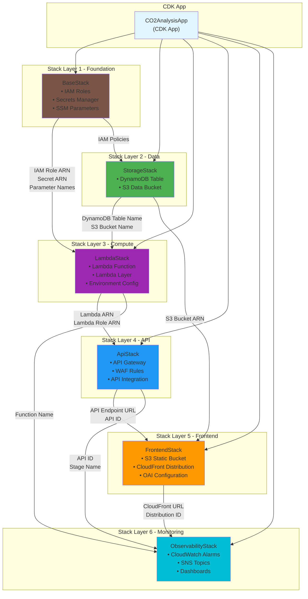

# CDK Stack Structure and Dependencies

## Overview

This document describes the CDK stack architecture for the AWS migration, including stack dependencies, outputs, and deployment order.

## Stack Dependency Diagram



## Stack Deployment Order

Stacks must be deployed in the following order due to dependencies:

1. **BaseStack** (Layer 1)
2. **StorageStack** (Layer 2)
3. **LambdaStack** (Layer 3)
4. **ApiStack** (Layer 4)
5. **FrontendStack** (Layer 5)
6. **ObservabilityStack** (Layer 6)

CDK will automatically handle this order based on the dependencies defined in the code.

## Stack Details

### 1. BaseStack (Foundation)

**Purpose**: Provides foundational security and configuration resources.

**Resources**:
- IAM Role: `LambdaExecutionRole`
- Secrets Manager Secret: `gemini-api-key`
- SSM Parameters:
  - `/app/gemini-model`
  - `/app/cache-ttl-days`
  - `/app/environment`

**Outputs**:
```typescript
{
  lambdaRoleArn: string,           // IAM role for Lambda
  secretArn: string,               // Secrets Manager ARN
  secretName: string,              // Secrets Manager name
  geminiModelParam: string,        // SSM parameter name
  cacheTtlParam: string,           // SSM parameter name
  environmentParam: string         // SSM parameter name
}
```

**Dependencies**: None

**Deployment Time**: ~2 minutes

---

### 2. StorageStack (Data Layer)

**Purpose**: Provides data storage resources.

**Resources**:
- DynamoDB Table: `CO2ReasoningCache`
  - Partition Key: `cache_key` (String)
  - TTL: `ttl` attribute (90 days)
  - Billing: On-Demand
  - Backup: Point-in-time recovery enabled
- S3 Bucket: `co2-data`
  - Versioning: Enabled
  - Lifecycle: Transition to IA after 90 days
  - Encryption: AES-256

**Outputs**:
```typescript
{
  dynamodbTableName: string,       // DynamoDB table name
  dynamodbTableArn: string,        // DynamoDB table ARN
  dataBucketName: string,          // S3 bucket name
  dataBucketArn: string            // S3 bucket ARN
}
```

**Dependencies**:
- BaseStack (IAM policies)

**Deployment Time**: ~3 minutes

---

### 3. LambdaStack (Compute Layer)

**Purpose**: Provides serverless compute for API logic.

**Resources**:
- Lambda Layer: `dependencies-layer`
  - Runtime: Python 3.11
  - Contents: google-generativeai, boto3
- Lambda Function: `reasoning-handler`
  - Runtime: Python 3.11
  - Handler: `lambda_handler.reasoning_handler`
  - Memory: 512 MB
  - Timeout: 30 seconds
  - Provisioned Concurrency: 1
  - Environment Variables:
    - `DYNAMODB_TABLE_NAME` (from StorageStack)
    - `SECRET_NAME` (from BaseStack)
    - `GEMINI_MODEL_PARAM` (from BaseStack)

**Outputs**:
```typescript
{
  lambdaFunctionArn: string,       // Lambda ARN
  lambdaFunctionName: string,      // Lambda name
  lambdaRoleArn: string,           // Lambda execution role
  lambdaLayerArn: string,          // Lambda layer ARN
  lambdaLogGroupName: string       // CloudWatch log group
}
```

**Dependencies**:
- BaseStack (IAM role, secret ARN, parameter names)
- StorageStack (DynamoDB table name)

**Deployment Time**: ~4 minutes

---

### 4. ApiStack (API Layer)

**Purpose**: Provides HTTP API interface.

**Resources**:
- API Gateway (REST):
  - Name: `CO2AnalysisAPI`
  - Stage: `prod`
  - Endpoints:
    - `GET /health` → Lambda proxy
    - `POST /reasoning` → Lambda proxy
  - Throttling: 100 req/sec per key
  - CORS: Enabled
  - API Key: Required
- API Key: `prod-api-key`
- Usage Plan: `prod-usage-plan`
  - Quota: 10,000 requests/day
  - Throttle: 100 req/sec
- WAF Web ACL:
  - Rate limit: 2000 req/5min per IP
  - Managed rules: AWSManagedRulesCommonRuleSet

**Outputs**:
```typescript
{
  apiEndpoint: string,             // API Gateway URL
  apiId: string,                   // API Gateway ID
  apiStageName: string,            // Stage name (prod)
  apiKeyId: string,                // API Key ID
  wafAclArn: string                // WAF ACL ARN
}
```

**Dependencies**:
- LambdaStack (Lambda function ARN)

**Deployment Time**: ~3 minutes

---

### 5. FrontendStack (Frontend Layer)

**Purpose**: Provides static website hosting and CDN.

**Resources**:
- S3 Bucket: `static-website`
  - Contents: HTML, JS, CSS files
  - Versioning: Enabled
  - Block Public Access: Enabled
- CloudFront Distribution:
  - Origins:
    - S3 Static Bucket (OAI access)
    - S3 Data Bucket (OAI access)
    - API Gateway (custom origin)
  - Cache Behaviors:
    - `/*.html` → S3 Static (1 hour TTL)
    - `/*.geojson` → S3 Data (24 hours TTL)
    - `/api/*` → API Gateway (no cache)
  - SSL Certificate: CloudFront default
  - Price Class: PriceClass_100 (US, Canada, Europe)
- Origin Access Identity (OAI): For S3 access

**Outputs**:
```typescript
{
  staticBucketName: string,        // S3 static bucket name
  cloudfrontUrl: string,           // CloudFront distribution URL
  cloudfrontId: string,            // CloudFront distribution ID
  oaiId: string                    // Origin Access Identity ID
}
```

**Dependencies**:
- StorageStack (S3 data bucket ARN)
- ApiStack (API endpoint URL)

**Deployment Time**: ~8-10 minutes (CloudFront is slow)

---

### 6. ObservabilityStack (Monitoring Layer)

**Purpose**: Provides monitoring, logging, and alerting.

**Resources**:
- CloudWatch Dashboard: `CO2AnalysisDashboard`
  - Widgets: Lambda metrics, API metrics, DynamoDB metrics
- SNS Topic: `alerts-topic`
  - Subscription: Email (configured via parameter)
- CloudWatch Alarms:
  - Lambda error rate > 5%
  - Lambda duration p99 > 25s
  - API Gateway 4xx rate > 20%
  - API Gateway 5xx rate > 1%
  - DynamoDB throttled requests > 0
  - Estimated monthly cost > threshold
- Log Insights Queries: Pre-configured queries

**Outputs**:
```typescript
{
  dashboardUrl: string,            // CloudWatch dashboard URL
  snsTopicArn: string,             // SNS topic ARN
  alarmNames: string[]             // List of alarm names
}
```

**Dependencies**:
- LambdaStack (Lambda function name, log group)
- ApiStack (API ID, stage name)
- FrontendStack (CloudFront distribution ID)

**Deployment Time**: ~2 minutes

## Cross-Stack References

### How CDK Handles Dependencies

CDK automatically manages cross-stack references using CloudFormation exports/imports.

**Example**:
```typescript
// In StorageStack
const table = new dynamodb.Table(this, 'CacheTable', {
  partitionKey: { name: 'cache_key', type: dynamodb.AttributeType.STRING }
});

// Export table name
new cdk.CfnOutput(this, 'TableName', {
  value: table.tableName,
  exportName: `${this.stackName}-TableName`
});

// In LambdaStack
const tableName = cdk.Fn.importValue(`${storageStackName}-TableName`);

const lambda = new lambda.Function(this, 'Handler', {
  environment: {
    DYNAMODB_TABLE_NAME: tableName
  }
});
```

### Best Practices

1. **Use CfnOutput for exports**: Make values available to other stacks
2. **Use descriptive export names**: Include stack name prefix
3. **Document required imports**: In stack constructor parameters
4. **Version your outputs**: If breaking changes are needed
5. **Minimize cross-stack dependencies**: Keep stacks loosely coupled

## CDK Commands

### Deploy All Stacks
```bash
cdk deploy --all
```

### Deploy Specific Stack
```bash
cdk deploy BaseStack
cdk deploy StorageStack
# etc.
```

### Deploy with Dependencies
```bash
# CDK automatically deploys dependencies
cdk deploy FrontendStack
# This will deploy BaseStack, StorageStack, and ApiStack if needed
```

### Destroy All Stacks
```bash
# Destroy in reverse order
cdk destroy ObservabilityStack
cdk destroy FrontendStack
cdk destroy ApiStack
cdk destroy LambdaStack
cdk destroy StorageStack
cdk destroy BaseStack
```

### View Dependency Graph
```bash
cdk ls --tree
```

## Stack Naming Convention

All stacks follow this naming pattern:
```
CO2Analysis-{Environment}-{StackName}
```

**Examples**:
- `CO2Analysis-Prod-BaseStack`
- `CO2Analysis-Prod-StorageStack`
- `CO2Analysis-Dev-LambdaStack`

This allows multiple environments (dev, staging, prod) to coexist in the same AWS account.

## Environment-Specific Configuration

### CDK Context
```json
{
  "dev": {
    "account": "111111111111",
    "region": "us-east-1",
    "provisionedConcurrency": 0,
    "wafEnabled": false
  },
  "prod": {
    "account": "222222222222",
    "region": "us-east-1",
    "provisionedConcurrency": 1,
    "wafEnabled": true
  }
}
```

### Usage
```bash
cdk deploy --context environment=prod --all
```

## Testing Stack Dependencies

### Unit Tests
```typescript
test('LambdaStack requires StorageStack outputs', () => {
  const app = new cdk.App();
  const baseStack = new BaseStack(app, 'Base');
  const storageStack = new StorageStack(app, 'Storage', { baseStack });

  const lambdaStack = new LambdaStack(app, 'Lambda', {
    baseStack,
    storageStack
  });

  expect(lambdaStack.dependencies).toContain(storageStack);
});
```

### Integration Tests
```bash
# Deploy to test environment
cdk deploy --context environment=test --all

# Run integration tests
npm run test:integration

# Destroy test environment
cdk destroy --context environment=test --all
```

## Troubleshooting

### Circular Dependencies
**Problem**: Stack A depends on Stack B, and Stack B depends on Stack A.

**Solution**:
- Refactor to remove circular reference
- Merge stacks if they're tightly coupled
- Use SSM Parameter Store as intermediary

### Export Already Exists
**Problem**: CloudFormation export name conflicts.

**Solution**:
- Delete the stack that's exporting the value
- Or rename the export
- Or use `cdk destroy` before redeploying

### Dependency Not Found
**Problem**: Stack can't find exported value.

**Solution**:
- Ensure dependency stack is deployed first
- Check export name matches import name
- Verify stacks are in same region

## Migration Impact

### Deploying Incrementally
It's possible to deploy stacks incrementally during migration:

1. **Phase 1**: Deploy BaseStack + StorageStack
   - Populate DynamoDB from cache.json
   - Upload GeoJSON to S3

2. **Phase 2**: Deploy LambdaStack + ApiStack
   - Test API endpoint directly
   - Keep Flask server running

3. **Phase 3**: Deploy FrontendStack
   - Update HTML to use new API
   - Gradual traffic shift

4. **Phase 4**: Deploy ObservabilityStack
   - Monitor for issues
   - Set up alerts

This allows testing each layer before moving to the next.

## Cost by Stack

Estimated monthly cost per stack:

| Stack | Cost | Notes |
|-------|------|-------|
| BaseStack | $0.40 | Secrets Manager only |
| StorageStack | $3-7 | DynamoDB + S3 |
| LambdaStack | $5-10 | Lambda invocations |
| ApiStack | $8-20 | API Gateway + WAF |
| FrontendStack | $5-15 | CloudFront + S3 |
| ObservabilityStack | $2-5 | CloudWatch + SNS |
| **Total** | **$23-57** | Moderate usage |

## Summary

The CDK stack structure provides:
- **Modularity**: Each stack has a single responsibility
- **Reusability**: Stacks can be deployed to multiple environments
- **Maintainability**: Easy to update individual components
- **Testability**: Each stack can be tested independently
- **Scalability**: Add new stacks without affecting existing ones

The dependency graph ensures proper deployment order and allows for incremental migration from Phase 1 to Phase 2.
