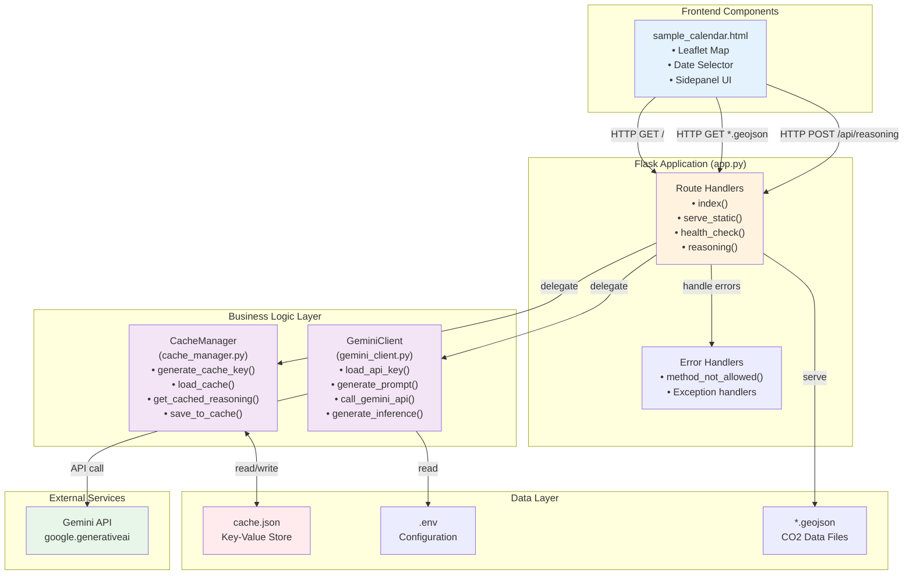
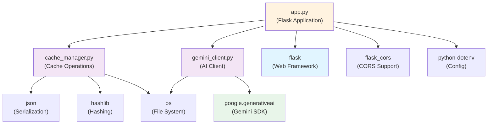
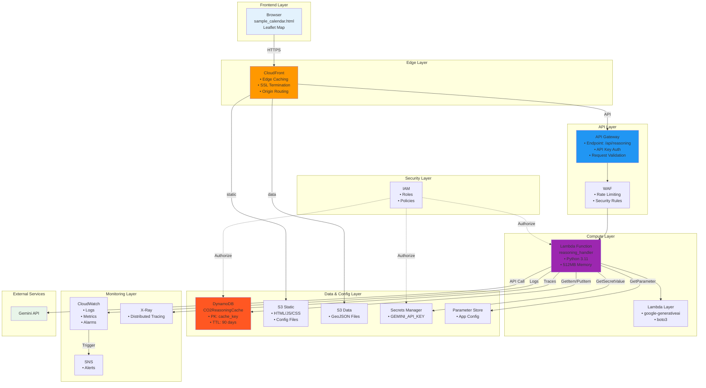
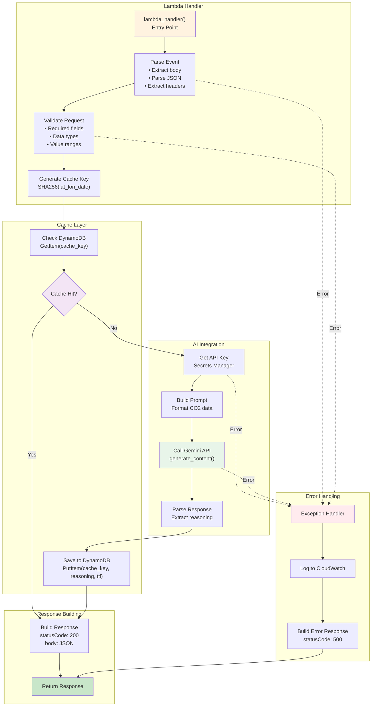
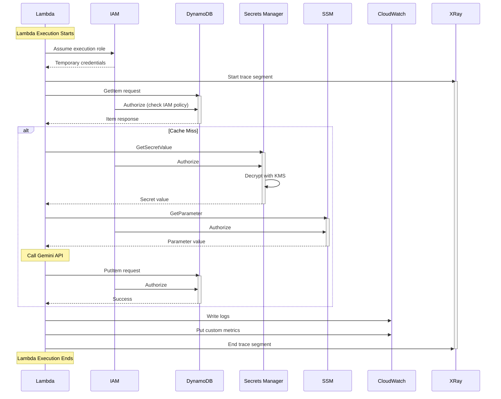
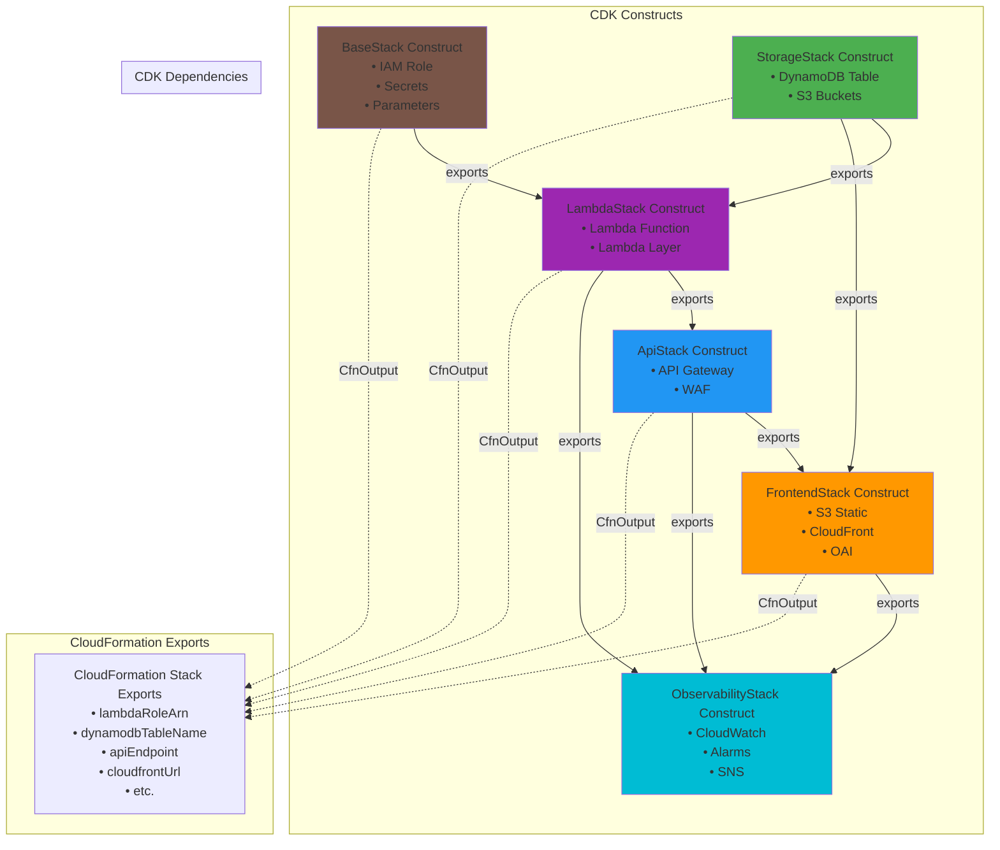

# Component Interaction Diagrams

## Overview

This document details how components interact with each other in both Phase 1 and Phase 2, showing the relationships, dependencies, and communication patterns.

---

## Phase 1 - Component Interaction

### High-Level Component Diagram



### Detailed Interaction: API Request Processing

```mermaid
graph LR
    subgraph "Request Flow"
        direction TB
        Request["HTTP Request"] --> CORS["CORS Middleware"]
        CORS --> RouteDispatch["Route Dispatcher"]
        RouteDispatch --> RouteHandler["Route Handler<br/>/api/reasoning"]
    end

    subgraph "Business Logic"
        direction TB
        RouteHandler --> Validate["Parameter Validation"]
        Validate --> CacheCheck["Cache Manager<br/>Check Cache"]
        CacheCheck -->|"Hit"| BuildResponse["Build Response"]
        CacheCheck -->|"Miss"| GeminiCall["Gemini Client<br/>API Call"]
        GeminiCall --> CacheSave["Cache Manager<br/>Save Result"]
        CacheSave --> BuildResponse
    end

    subgraph "Response Flow"
        direction TB
        BuildResponse --> JSONify["JSON Serialization"]
        JSONify --> HTTPResponse["HTTP Response"]
    end

    style Request fill:#e3f2fd
    style CacheCheck fill:#f3e5f5
    style GeminiCall fill:#f3e5f5
    style HTTPResponse fill:#c8e6c9
```



### Module Dependencies



### Communication Patterns

#### Pattern 1: Synchronous Request-Response
```
Browser → Flask → CacheManager → Local File → Response
         ↓
         → GeminiClient → External API → Response
```

#### Pattern 2: Error Propagation
```
GeminiClient (Exception) → Flask (Catch) → Browser (Error Response)
```

#### Pattern 3: Cache-Aside Pattern
```
1. Check cache (cache_manager.get_cached_reasoning)
2. If miss: Fetch from source (gemini_client.generate_inference)
3. Save to cache (cache_manager.save_to_cache)
4. Return result
```

---

## Phase 2 - Component Interaction

### High-Level Component Diagram



### Detailed Interaction: Lambda Function Internal



### AWS Service Interactions



### CDK Component Relationships



### Communication Patterns

#### Pattern 1: Request-Response with Caching
```
Browser → CloudFront → API Gateway → Lambda → DynamoDB (check)
                                             ↓ (miss)
                                             Secrets Manager → Gemini API
                                             ↓
                                             DynamoDB (save) → Response
```

#### Pattern 2: Asynchronous Monitoring
```
Lambda → CloudWatch Logs (async)
       → X-Ray (async)
       → CloudWatch Metrics (async)

CloudWatch Alarms → SNS → Email (when threshold exceeded)
```

#### Pattern 3: IAM Authorization
```
Every AWS service call:
1. Lambda uses execution role
2. IAM evaluates policy
3. Allow or Deny
4. Service executes (if allowed)
```

#### Pattern 4: Secret Management
```
Lambda cold start:
1. GetSecretValue (Secrets Manager)
2. Decrypt with KMS
3. Cache in memory
4. Reuse for warm invocations
```

---

## Component Communication Matrix

### Phase 1 Communication Matrix

| Component | Communicates With | Protocol | Direction | Purpose |
|-----------|------------------|----------|-----------|---------|
| Browser | Flask | HTTP | Bidirectional | API requests |
| Flask | cache_manager | Function Call | Unidirectional | Cache operations |
| Flask | gemini_client | Function Call | Unidirectional | AI inference |
| cache_manager | cache.json | File I/O | Bidirectional | Data persistence |
| gemini_client | Gemini API | HTTPS | Unidirectional | AI generation |
| gemini_client | .env | File I/O | Read-only | Configuration |

### Phase 2 Communication Matrix

| Component | Communicates With | Protocol | Direction | Purpose |
|-----------|------------------|----------|-----------|---------|
| Browser | CloudFront | HTTPS | Bidirectional | Content delivery |
| CloudFront | API Gateway | HTTPS | Bidirectional | API proxy |
| CloudFront | S3 | HTTPS | Read-only | Static content |
| API Gateway | Lambda | Event-driven | Unidirectional | Function invocation |
| API Gateway | WAF | Integration | Bidirectional | Security filtering |
| Lambda | DynamoDB | AWS API | Bidirectional | Data operations |
| Lambda | Secrets Manager | AWS API | Read-only | Secret retrieval |
| Lambda | SSM | AWS API | Read-only | Config retrieval |
| Lambda | Gemini API | HTTPS | Unidirectional | AI generation |
| Lambda | CloudWatch | AWS API | Write-only | Logging/metrics |
| Lambda | X-Ray | AWS API | Write-only | Tracing |
| CloudWatch | SNS | Event-driven | Unidirectional | Alarm notifications |
| IAM | All AWS Services | Authorization | Bidirectional | Access control |

---

## Integration Points

### Phase 1 → Phase 2 Migration Mapping

| Phase 1 Component | Phase 2 Component(s) | Changes Required |
|------------------|---------------------|------------------|
| Flask routes | API Gateway + Lambda | Convert to Lambda handlers |
| cache_manager.py | Lambda + DynamoDB SDK | Replace file I/O with DynamoDB calls |
| gemini_client.py | Lambda (same logic) | Add Secrets Manager integration |
| cache.json | DynamoDB Table | Migrate data, add TTL |
| .env file | Secrets Manager + SSM | Store secrets securely |
| Static files | S3 + CloudFront | Upload files, configure CDN |
| Local logs | CloudWatch Logs | Automatic (Lambda integration) |

### Key Integration Challenges

1. **State Management**:
   - Phase 1: File-based (cache.json)
   - Phase 2: DynamoDB (requires schema design)

2. **Authentication**:
   - Phase 1: None
   - Phase 2: API Key + IAM (requires key management)

3. **Error Handling**:
   - Phase 1: Flask exception handlers
   - Phase 2: Lambda + CloudWatch Alarms (requires monitoring setup)

4. **Secrets**:
   - Phase 1: .env file
   - Phase 2: Secrets Manager (requires secure migration)

5. **Deployment**:
   - Phase 1: Manual (python app.py)
   - Phase 2: CDK (requires IaC knowledge)

---

## Component Lifecycle

### Phase 1 Lifecycle

```
1. Start: python app.py
2. Load: Import modules, read .env
3. Run: Flask server listens on port 5000
4. Request: Handle HTTP requests synchronously
5. Stop: Ctrl+C (graceful shutdown)
```

### Phase 2 Lifecycle

#### Lambda Function Lifecycle
```
1. Cold Start (first invocation or after idle):
   - Download code package
   - Initialize runtime (Python 3.11)
   - Load Lambda layer
   - Import modules
   - Execute init code
   - Cache secrets
   Duration: 1-3 seconds

2. Warm Invocation (subsequent calls):
   - Reuse existing container
   - Execute handler function
   - Reuse cached secrets/connections
   Duration: 50-200ms

3. Idle Timeout (15 minutes):
   - Container frozen
   - Next invocation = cold start
```

#### CDK Stack Lifecycle
```
1. Synth: cdk synth (generate CloudFormation)
2. Deploy: cdk deploy (create/update resources)
3. Update: cdk deploy (modify existing resources)
4. Rollback: Automatic on failure
5. Destroy: cdk destroy (delete all resources)
```

---

## Summary

### Phase 1 Strengths
- **Simple**: Few components, easy to understand
- **Fast Development**: Quick iteration, no deploy cycle
- **Cheap**: No cloud costs

### Phase 1 Weaknesses
- **Not Scalable**: Single-threaded Flask
- **No Redundancy**: Single point of failure
- **Limited Monitoring**: Manual log checking

### Phase 2 Strengths
- **Scalable**: Auto-scaling Lambda and DynamoDB
- **Reliable**: Multi-AZ, automatic failover
- **Monitored**: CloudWatch, X-Ray, automated alerts
- **Secure**: IAM, WAF, Secrets Manager

### Phase 2 Weaknesses
- **Complex**: Many components, steep learning curve
- **Cost**: Pay-per-use (though minimal)
- **Cold Starts**: Lambda cold start latency

The component interaction diagrams show that while Phase 2 has more moving parts, the core business logic remains the same, making the migration primarily an infrastructure change rather than a logic rewrite.
