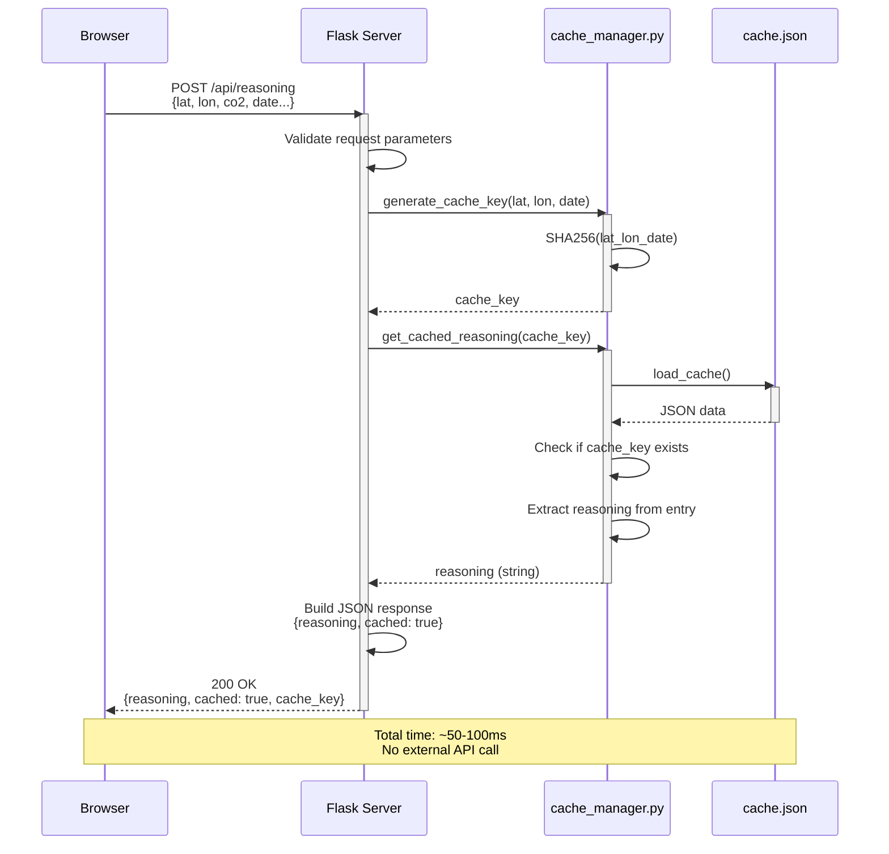
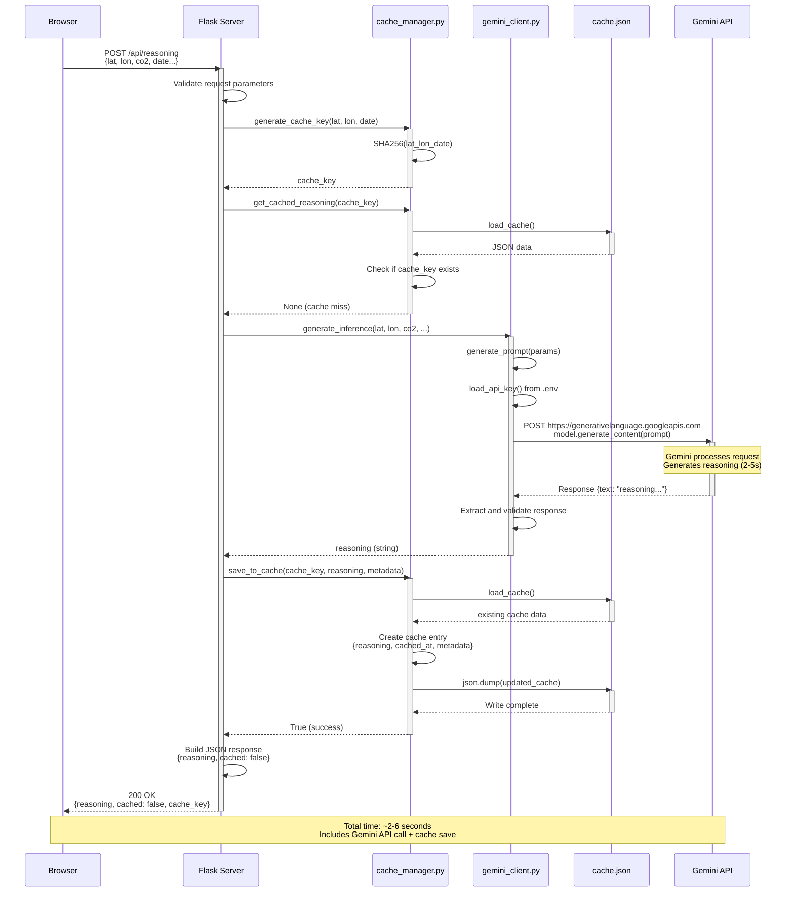
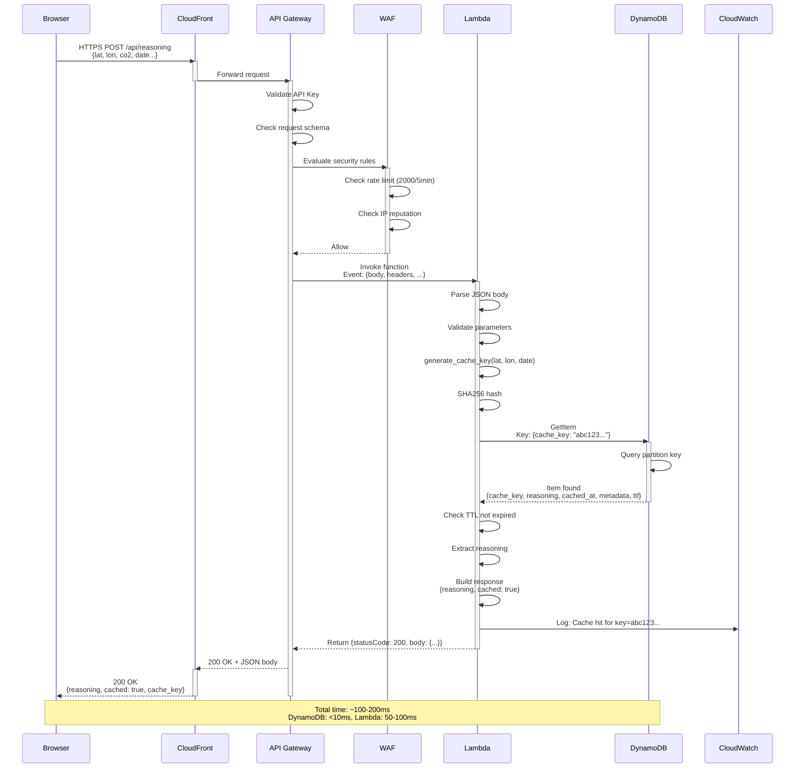
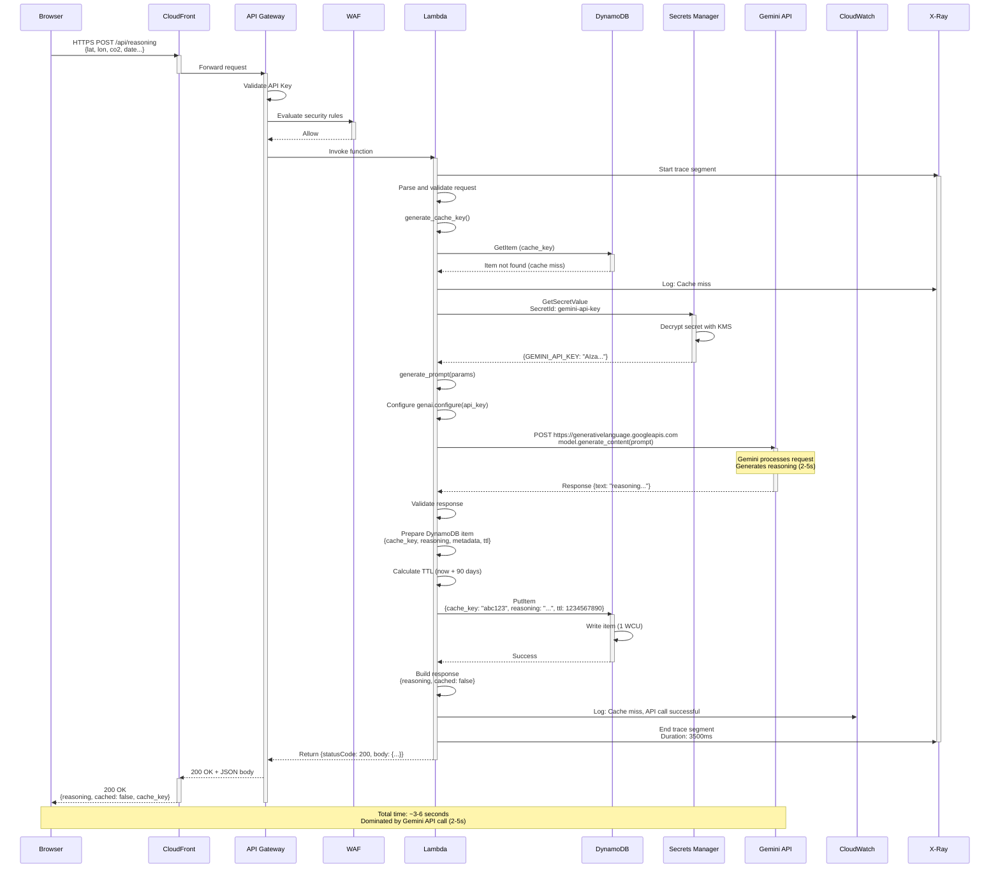
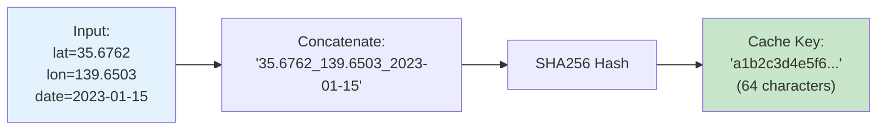
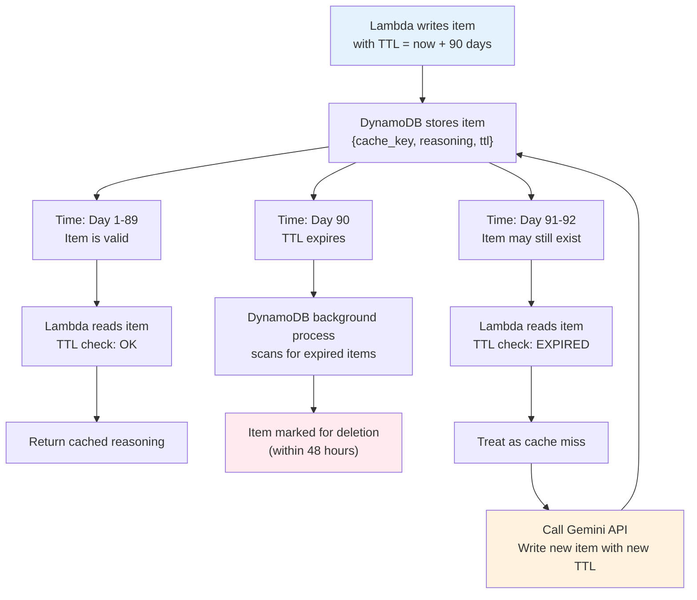
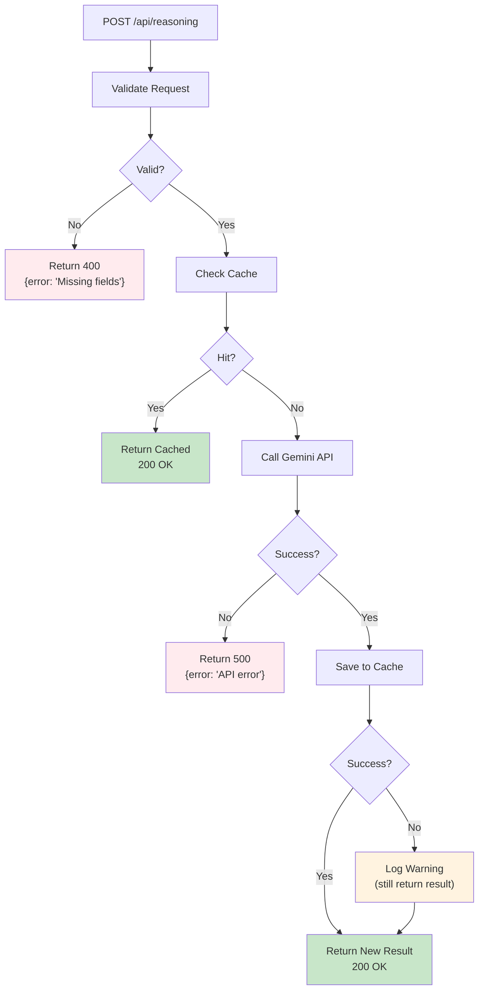
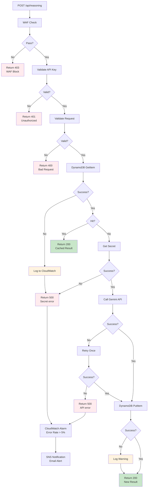

# Data Flow Diagrams

## Overview

This document shows detailed data flows through the system, focusing on cache hit and cache miss scenarios for both Phase 1 and Phase 2.

---

## Phase 1 - Data Flow (Local)

### Cache Hit Scenario



**Steps**:
1. Browser sends POST request with CO2 data
2. Flask validates required fields
3. cache_manager generates SHA256 cache key
4. cache_manager loads cache.json from disk
5. **Cache Hit**: Key found in cache
6. Extract reasoning text from cache entry
7. Return response immediately (cached: true)

**Performance**:
- Latency: 50-100ms
- Bottleneck: Local file I/O
- No external API calls

---

### Cache Miss Scenario



**Steps**:
1. Browser sends POST request with CO2 data
2. Flask validates required fields
3. cache_manager generates cache key
4. cache_manager checks cache.json
5. **Cache Miss**: Key not found
6. gemini_client generates prompt from parameters
7. gemini_client loads API key from .env
8. gemini_client calls Gemini API (2-5s)
9. Gemini returns reasoning text
10. cache_manager saves result to cache.json
11. Return response to browser (cached: false)

**Performance**:
- Latency: 2-6 seconds
- Bottleneck: Gemini API network call
- Cache saved for future requests

---

## Phase 2 - Data Flow (AWS)

### Cache Hit Scenario



**Steps**:
1. Browser sends HTTPS POST to CloudFront
2. CloudFront forwards to API Gateway (no caching for POST)
3. API Gateway validates API key and request schema
4. WAF evaluates security rules (rate limit, IP checks)
5. Lambda function invoked with event
6. Lambda parses request and generates cache key
7. Lambda queries DynamoDB for cache_key
8. **Cache Hit**: Item found in DynamoDB
9. Lambda checks TTL not expired
10. Lambda extracts reasoning from item
11. Lambda logs to CloudWatch
12. Return response through stack (cached: true)

**Performance**:
- Total Latency: 100-200ms
- DynamoDB Query: <10ms (single-digit latency)
- Lambda Execution: 50-100ms (warm start)
- API Gateway: 20-30ms
- CloudFront: 20-50ms
- No external API calls

**Cost per Request**:
- Lambda: $0.0000002 (200ms @ 512MB)
- DynamoDB: $0.00000025 (1 RCU)
- API Gateway: $0.0000035 (per request)
- **Total**: ~$0.000004 per cache hit

---

### Cache Miss Scenario



**Steps**:
1. Browser sends HTTPS POST to CloudFront
2. API Gateway validates API key, WAF checks rules
3. Lambda function invoked
4. X-Ray starts tracing
5. Lambda generates cache key
6. Lambda queries DynamoDB
7. **Cache Miss**: Item not found
8. Lambda retrieves API key from Secrets Manager
9. Secrets Manager decrypts with KMS
10. Lambda generates prompt
11. Lambda calls Gemini API (2-5s)
12. Gemini returns reasoning
13. Lambda calculates TTL (90 days from now)
14. Lambda saves result to DynamoDB with TTL
15. Lambda logs to CloudWatch
16. X-Ray records trace
17. Return response (cached: false)

**Performance**:
- Total Latency: 3-6 seconds
- DynamoDB Operations: <20ms (GetItem + PutItem)
- Secrets Manager: ~50-100ms (first call, then cached)
- Gemini API: 2-5 seconds (dominant factor)
- Lambda Execution: 3-6 seconds
- X-Ray Overhead: <10ms

**Cost per Request**:
- Lambda: $0.000003 (3s @ 512MB)
- DynamoDB: $0.00000150 (1 RCU + 1 WCU)
- API Gateway: $0.0000035
- Secrets Manager: $0.00000005 (cached after first call)
- **Total**: ~$0.000008 per cache miss

---

## Cache Key Generation

Both Phase 1 and Phase 2 use the same cache key algorithm:



**Properties**:
- **Deterministic**: Same input always produces same key
- **Collision-resistant**: Different inputs produce different keys
- **Fixed length**: 64 characters (256 bits)
- **Consistent**: Works in both Phase 1 and Phase 2

**Example**:
```python
# Input
lat = 35.6762
lon = 139.6503
date = "2023-01-15"

# Concatenate
key_string = f"{lat}_{lon}_{date}"
# Result: "35.6762_139.6503_2023-01-15"

# Hash
cache_key = hashlib.sha256(key_string.encode('utf-8')).hexdigest()
# Result: "a1b2c3d4e5f6..." (64 hex characters)
```

---

## Cache TTL Flow (Phase 2 Only)

DynamoDB automatically deletes expired items based on the TTL attribute.



**TTL Behavior**:
1. Item written with `ttl = current_timestamp + (90 * 24 * 60 * 60)`
2. DynamoDB checks TTL in background (typically within 48 hours of expiration)
3. Expired items are automatically deleted (no cost)
4. Lambda should check TTL before using cached data
5. If item expired but not yet deleted, Lambda treats as cache miss

**Benefits**:
- Automatic cache invalidation
- No manual cleanup required
- No cost for deletions
- Keeps table size bounded

---

## Error Handling Flow

### Phase 1 Error Handling



### Phase 2 Error Handling



---

## Performance Comparison

### Cache Hit Performance

| Metric | Phase 1 (Local) | Phase 2 (AWS) |
|--------|-----------------|---------------|
| Total Latency | 50-100ms | 100-200ms |
| Cache Lookup | 20-50ms (file I/O) | <10ms (DynamoDB) |
| Response Build | 10-20ms | 50-100ms (Lambda) |
| Network Overhead | Minimal (localhost) | 50-100ms (CloudFront + API Gateway) |
| Cost per Request | $0 | ~$0.000004 |

### Cache Miss Performance

| Metric | Phase 1 (Local) | Phase 2 (AWS) |
|--------|-----------------|---------------|
| Total Latency | 2-6s | 3-6s |
| Cache Lookup | 20-50ms | <10ms |
| API Call | 2-5s | 2-5s |
| Cache Save | 50-100ms (file write) | <10ms (DynamoDB) |
| Secret Retrieval | N/A (.env file) | 50-100ms (first call) |
| Cost per Request | $0 (plus API quota) | ~$0.000008 |

### Throughput

| Metric | Phase 1 | Phase 2 |
|--------|---------|---------|
| Max Concurrent | ~10-20 (Flask dev server) | 1000+ (Lambda) |
| Requests/sec (cached) | ~10-20 | 100+ (with provisioned concurrency) |
| Requests/sec (uncached) | ~0.2-0.5 (API bottleneck) | Same (Gemini API limited) |

---

## Summary

### Key Differences

1. **Cache Storage**:
   - Phase 1: Local JSON file (cache.json)
   - Phase 2: DynamoDB with TTL

2. **Performance**:
   - Phase 1: Faster for cache hits (no network), limited concurrency
   - Phase 2: Slightly slower per request, massively scalable

3. **Cost**:
   - Phase 1: Free (local), but requires running server
   - Phase 2: Pay-per-use (~$0.000004-0.000008 per request)

4. **Reliability**:
   - Phase 1: Single point of failure, no redundancy
   - Phase 2: Multi-AZ, automatic failover, backups

5. **Monitoring**:
   - Phase 1: Manual log checking
   - Phase 2: CloudWatch, X-Ray, automated alarms

The data flow diagrams show that while Phase 2 has more components, the overall flow logic remains similar, making migration straightforward.
