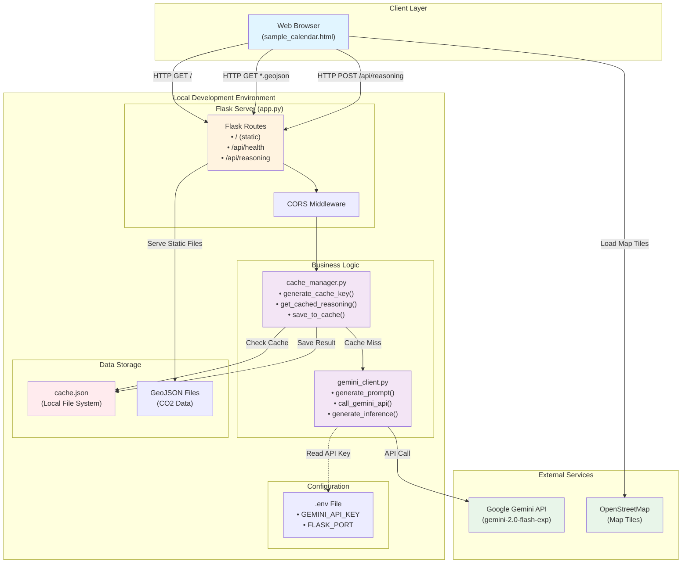

# Phase 1 - Local Architecture

## Current State (Local Prototype)

This diagram shows the current architecture running locally with Flask and local file storage.

## Component Details

### Client Layer
- **Web Browser**: Renders interactive map using Leaflet.js
- **sample_calendar.html**: Single-page application with date selector and map interface

### Flask Server (app.py)
- **Port**: 5000 (configurable via .env)
- **CORS**: Enabled for all origins (development configuration)
- **Routes**:
  - `GET /`: Serves sample_calendar.html
  - `GET /<path>`: Serves static files (GeoJSON, JS, CSS)
  - `GET /api/health`: Health check endpoint
  - `POST /api/reasoning`: CO2 anomaly reasoning generation

### Business Logic
- **cache_manager.py**:
  - Generates SHA256 cache keys from lat/lon/date
  - Manages JSON file-based cache
  - Provides get/save operations

- **gemini_client.py**:
  - Constructs prompts for Gemini API
  - Handles API authentication
  - Processes API responses

### Data Storage
- **cache.json**:
  - Structure: `{cache_key: {reasoning, cached_at, metadata}}`
  - Persists across server restarts
  - No TTL or size limits

- **GeoJSON Files**:
  - Format: `anomalies[YYYYMM].geojson`
  - Contains CO2 observation points with properties

### Configuration
- **.env File**:
  - `GEMINI_API_KEY`: API authentication
  - `FLASK_PORT`: Server port (default: 5000)
  - `GEMINI_MODEL`: Model name (default: gemini-2.0-flash-exp)

## Request Flow

### Static Content Request
1. Browser requests HTML/GeoJSON
2. Flask serves from local filesystem
3. Browser renders content

### API Reasoning Request
1. Browser sends POST to `/api/reasoning` with CO2 data
2. Flask validates request parameters
3. Cache manager checks cache.json
4. **Cache Hit**: Returns cached result immediately
5. **Cache Miss**:
   - Gemini client generates prompt
   - Calls Gemini API
   - Receives reasoning response
   - Cache manager saves to cache.json
   - Returns result to browser

## Technology Stack

### Frontend
- HTML5/CSS3
- JavaScript (ES6+)
- Leaflet.js 1.9.4

### Backend
- Python 3.8+
- Flask 3.0
- Flask-CORS 4.0

### AI Service
- Google Generative AI SDK 0.3
- Gemini 2.0 Flash Exp model

### Data Storage
- JSON (local file)
- GeoJSON (static files)

## Limitations

1. **Scalability**: Single-process Flask server
2. **Concurrency**: No request queueing
3. **Storage**: File-based cache (no size limits)
4. **Security**:
   - No authentication
   - CORS open to all origins
   - API key in .env file
5. **Reliability**: No error recovery or retry logic
6. **Monitoring**: No logging or metrics
7. **Deployment**: Manual server startup required

## Performance Characteristics

- **Cold Start**: N/A (always running)
- **First Request**: 2-5 seconds (Gemini API call)
- **Cached Request**: <100ms (local file read)
- **Concurrent Requests**: Limited by Flask dev server
- **Cache Size**: Unbounded (grows indefinitely)

## Development Experience

### Pros
- Simple setup (pip install + python app.py)
- Fast iteration (Flask debug mode)
- Easy debugging (local logs)
- No cloud costs

### Cons
- Manual server management
- No production-ready configuration
- Cache persistence depends on file system
- API key management in plain text
