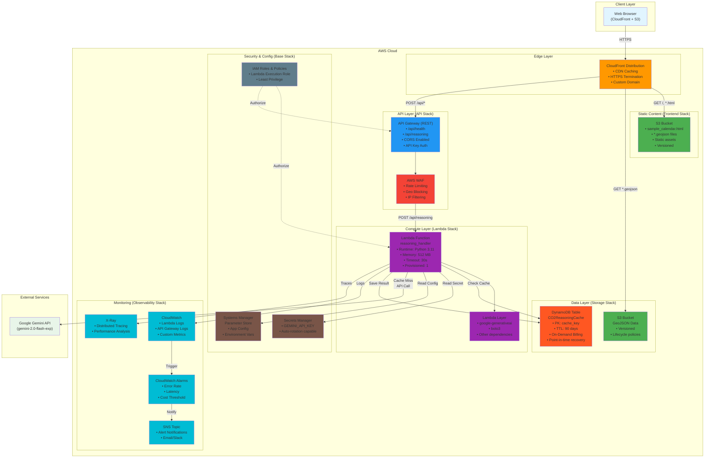

# Phase 2 - AWS Architecture

## Target State (AWS Serverless)

This diagram shows the target architecture using AWS services deployed via CDK.

## Component Details

### Edge Layer

#### CloudFront Distribution
- **Purpose**: Content delivery and HTTPS termination
- **Origins**:
  - S3 Static Bucket (frontend assets)
  - S3 Data Bucket (GeoJSON files)
  - API Gateway (API endpoints)
- **Cache Behaviors**:
  - Static HTML/JS/CSS: 1 hour TTL
  - GeoJSON files: 24 hours TTL
  - API calls: No caching
- **Custom Domain**: Optional (Route53 integration)
- **SSL Certificate**: ACM-managed

### Static Content (Frontend Stack)

#### S3 Static Bucket
- **Contents**:
  - sample_calendar.html
  - JavaScript/CSS assets
  - Configuration files
- **Configuration**:
  - Versioning enabled
  - Server-side encryption (AES-256)
  - Block public access enabled
  - CloudFront OAI access only
- **Lifecycle Rules**: None (static assets)

#### S3 Data Bucket
- **Contents**: GeoJSON files (anomalies*.geojson)
- **Configuration**:
  - Versioning enabled
  - Lifecycle policy: Transition to IA after 90 days
  - Intelligent-Tiering for cost optimization
- **Size**: ~100MB per year of data

### API Layer (API Stack)

#### API Gateway (REST)
- **Type**: REST API (not HTTP API)
- **Endpoints**:
  - `GET /health`: Health check
  - `POST /reasoning`: Generate reasoning
- **Security**:
  - API Key authentication
  - Request validation
  - Throttling: 100 req/sec per key
  - Burst: 200 requests
- **CORS**: Configured for CloudFront origin
- **Logging**: Full request/response logging
- **Stage**: `prod` (single stage)

#### AWS WAF
- **Purpose**: DDoS protection and request filtering
- **Rules**:
  - Rate limiting: 2000 requests per 5 minutes per IP
  - Geo blocking: Optional country allowlist
  - Common attack patterns (SQLi, XSS)
  - IP reputation lists
- **Cost**: ~$5-10/month

### Compute Layer (Lambda Stack)

#### Lambda Function - reasoning_handler
- **Runtime**: Python 3.11
- **Handler**: `lambda_handler.reasoning_handler`
- **Memory**: 512 MB (configurable)
- **Timeout**: 30 seconds
- **Environment Variables**:
  - `DYNAMODB_TABLE_NAME`: Cache table name
  - `SECRET_NAME`: Secrets Manager secret ARN
  - `GEMINI_MODEL`: Model name (from SSM)
- **Reserved Concurrency**: None (uses account limit)
- **Provisioned Concurrency**: 1 (reduces cold starts)
- **VPC**: No VPC (public internet access)
- **Code Size**: ~50 KB (without dependencies)

#### Lambda Layer
- **Contents**:
  - `google-generativeai==0.3.x`
  - `boto3` (AWS SDK)
  - Other Python dependencies
- **Size**: ~30 MB
- **Versions**: Managed separately
- **Reusability**: Shared across functions

### Data Layer (Storage Stack)

#### DynamoDB Table - CO2ReasoningCache
- **Table Name**: `${StackName}-CO2ReasoningCache`
- **Primary Key**: `cache_key` (String, Partition Key)
- **Attributes**:
  - `cache_key`: SHA256 hash of lat/lon/date
  - `reasoning`: Text response (up to 4 KB)
  - `cached_at`: ISO timestamp
  - `metadata`: Map (lat, lon, co2, etc.)
  - `ttl`: Expiration timestamp (90 days)
- **Capacity Mode**: On-Demand
- **TTL**: Enabled on `ttl` attribute
- **Backup**:
  - Point-in-time recovery enabled
  - On-demand backups monthly
- **Encryption**: AWS-managed keys (SSE)
- **Global Tables**: Not required (single region)
- **Estimated Cost**: ~$1-5/month (10K items)

### Security & Configuration (Base Stack)

#### Secrets Manager
- **Secret Name**: `${StackName}/gemini-api-key`
- **Type**: SecretString
- **Value**: `{"GEMINI_API_KEY": "AIza..."}`
- **Rotation**: Manual (API keys don't auto-rotate)
- **Encryption**: AWS-managed KMS key
- **Cost**: $0.40/month per secret

#### Systems Manager Parameter Store
- **Parameters**:
  - `/app/gemini-model`: String (gemini-2.0-flash-exp)
  - `/app/cache-ttl-days`: String (90)
  - `/app/environment`: String (prod)
- **Type**: Standard (free)
- **Tier**: Standard (no cost)

#### IAM Roles & Policies
- **Lambda Execution Role**:
  - `AWSLambdaBasicExecutionRole` (CloudWatch Logs)
  - DynamoDB read/write permissions
  - Secrets Manager read permission
  - SSM Parameter Store read permission
  - X-Ray write permission
- **Principle of Least Privilege**: Scoped to specific resources

### Monitoring (Observability Stack)

#### CloudWatch Logs
- **Log Groups**:
  - `/aws/lambda/reasoning-handler`
  - `/aws/apigateway/${ApiName}`
- **Retention**: 14 days (configurable)
- **Insights**: Enabled for query analysis
- **Cost**: ~$0.50-2/month

#### X-Ray
- **Tracing**: Active tracing on Lambda
- **Sampling**: 5% of requests (configurable)
- **Service Map**: Shows dependencies
- **Cost**: $0.50-2/month

#### CloudWatch Alarms
- **Metrics Monitored**:
  - Lambda error rate > 5%
  - Lambda duration > 25s (p99)
  - API Gateway 4xx rate > 20%
  - API Gateway 5xx rate > 1%
  - DynamoDB throttled requests > 0
  - Estimated monthly cost > threshold
- **Actions**: SNS notification

#### SNS Topic
- **Subscribers**: Email (expandable to Slack/PagerDuty)
- **Protocol**: Email, HTTPS
- **Filtering**: By alarm severity

## Request Flow

### Static Content Request
1. Browser requests HTML/GeoJSON via HTTPS
2. CloudFront checks cache
3. **Cache Hit**: Returns cached content
4. **Cache Miss**: Fetches from S3, caches, returns

### API Reasoning Request - Cache Hit
1. Browser sends POST to CloudFront
2. CloudFront forwards to API Gateway
3. API Gateway validates request, checks API key
4. WAF evaluates security rules
5. Lambda function invoked
6. Lambda checks DynamoDB cache
7. **Cache Hit**: Returns cached reasoning (~100ms)
8. Response flows back through stack

### API Reasoning Request - Cache Miss
1. Steps 1-6 same as above
2. **Cache Miss**: Lambda reads API key from Secrets Manager
3. Lambda calls Gemini API (~2-5s)
4. Lambda saves result to DynamoDB with TTL
5. Returns reasoning to client
6. Total time: ~3-6s

### Error Handling Flow
1. Lambda catches exceptions
2. Logs error to CloudWatch
3. Returns appropriate HTTP status code
4. CloudWatch Alarm evaluates error rate
5. If threshold exceeded, SNS notification sent

## Technology Stack

### Frontend
- Same as Phase 1 (HTML/CSS/JS/Leaflet)
- Hosted on S3 + CloudFront

### Backend
- Python 3.11 (Lambda runtime)
- Boto3 (AWS SDK)
- Google Generative AI SDK 0.3

### Infrastructure
- AWS CDK (TypeScript)
- CloudFormation (generated by CDK)

### AI Service
- Google Gemini API (same as Phase 1)

## Advantages Over Phase 1

### Scalability
- Auto-scaling Lambda (1000 concurrent executions)
- DynamoDB auto-scaling (on-demand)
- CloudFront edge caching (global)

### Reliability
- Multi-AZ availability (DynamoDB, Lambda)
- DynamoDB point-in-time recovery
- CloudFront redundancy

### Security
- API key authentication
- WAF protection
- Secrets Manager encryption
- IAM least privilege
- HTTPS everywhere

### Performance
- CloudFront edge caching (<50ms)
- Lambda provisioned concurrency
- DynamoDB single-digit ms latency

### Monitoring
- CloudWatch Logs and Metrics
- X-Ray distributed tracing
- CloudWatch Alarms
- Cost tracking

### Cost Efficiency
- Pay-per-use (no idle costs)
- DynamoDB TTL (auto-cleanup)
- S3 lifecycle policies
- CloudFront caching reduces origin requests

### Developer Experience
- Infrastructure as Code (CDK)
- Automated deployments (CI/CD ready)
- Blue/green deployments
- Rollback capability

## Cost Estimate

### Monthly Cost (Moderate Usage)
- **Lambda**: $5-10 (100K invocations, 512MB, 5s avg)
- **API Gateway**: $3.50 (1M requests)
- **DynamoDB**: $2-5 (on-demand, 10K items)
- **S3**: $1-2 (storage + requests)
- **CloudFront**: $5-15 (data transfer)
- **Secrets Manager**: $0.40 (1 secret)
- **CloudWatch**: $2-5 (logs + metrics)
- **WAF**: $5-10 (rules + requests)
- **X-Ray**: $0.50-2 (sampling)
- **Total**: ~$25-55/month

### Annual Cost: ~$300-660

### Cost Optimization
- Use CloudFront caching aggressively
- Enable DynamoDB TTL to limit table size
- Use Lambda reserved concurrency wisely
- Consider S3 Intelligent-Tiering
- Review and remove unused logs

## Migration Path

### Pre-Migration
1. Set up AWS account
2. Configure AWS CLI and CDK
3. Create parameter values (API keys, configs)

### Phase 1: Base Infrastructure
1. Deploy Base Stack (IAM, Secrets Manager, SSM)
2. Store Gemini API key in Secrets Manager
3. Validate secret access

### Phase 2: Data Layer
1. Deploy Storage Stack (DynamoDB, S3)
2. Create DynamoDB table
3. Upload GeoJSON files to S3

### Phase 3: Compute Layer
1. Build Lambda layer (dependencies)
2. Convert Flask code to Lambda handler
3. Deploy Lambda Stack
4. Test Lambda function directly

### Phase 4: API Layer
1. Deploy API Stack (API Gateway, WAF)
2. Configure API Gateway endpoints
3. Test API endpoints

### Phase 5: Frontend
1. Update sample_calendar.html API endpoint
2. Deploy Frontend Stack (S3, CloudFront)
3. Upload static files to S3
4. Configure CloudFront distribution

### Phase 6: Monitoring
1. Deploy Observability Stack
2. Configure CloudWatch Alarms
3. Set up SNS notifications

### Phase 7: Testing & Cutover
1. End-to-end testing
2. Performance testing
3. Update DNS (if using custom domain)
4. Monitor for 24-48 hours

### Post-Migration
1. Decommission local Flask server
2. Document new endpoints
3. Update README with AWS instructions

## Rollback Plan

If migration fails:
1. Revert DNS to point to local server
2. Keep Flask server running during migration
3. CDK stacks can be destroyed with `cdk destroy`
4. Data in DynamoDB can be exported if needed
